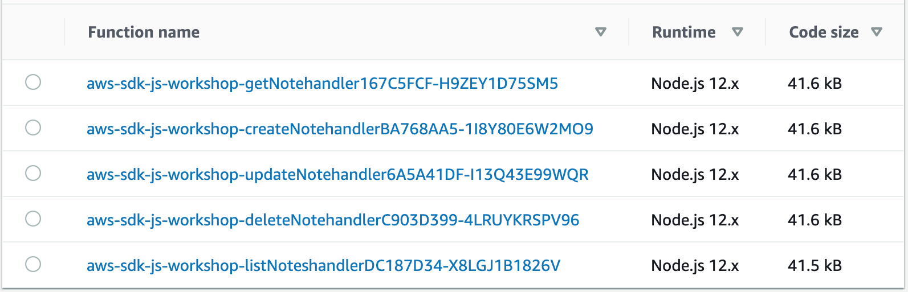

# DynamodDB client in v2 vs v3


- This package contains backend code which performs create, delete, get, list and update operations on DynamoDB
- It uses webpack to build single minimized bundle for each operation, and SAM CLI to package and deploy those bundles

## Set up

Ensure that you've followed pre-requisites from main [README](../../README.md)

### Create backend API

- Run `export AWS_JS_SDK_ID=<unique>-aws-js-sdk-v3-workshop`
  - the value in `<unique>` could be your name, for example
  - this value in `AWS_JS_SDK_ID` will be used for your S3 bucket and Cloud formation stack
- [Optional] Rename TableName in [template.yaml](./template.yaml#L22) if table already exists in DynamoDB
- `yarn`
- `yarn mb` to make S3 bucket
- `yarn build` to build the package (runs ESLint and TypeScript)
- `yarn package` to [package](https://docs.aws.amazon.com/serverless-application-model/latest/developerguide/sam-cli-command-reference-sam-package.html) your application
- `yarn deploy` to [deploy](https://docs.aws.amazon.com/serverless-application-model/latest/developerguide/sam-cli-command-reference-sam-deploy.html) your application (this takes time)
- `yarn bpd` to run build, package and deploy! (during development)

### Test backend API

- `yarn describe` to get API Gateway endpoint
- Visit the endpoint `<ENDPOINT>/Prod/notes` in the browser
- The contents of DynamoDB table in [template.yml](./template.yaml#L22) would be returned as JSON

### Clean resources

- `yarn clean` to delete resources

## Activities

In this section, we're going to update the code to import DynamoDB Client in different ways and compare the bundle sizes of the resulting lambda functions.

### Examine initial bundle size of lambda functions

- Login to [AWS Lambda Console](https://console.aws.amazon.com/lambda/home)
- The size of each lambda functions will be ~470KB

  

- This happens because entire aws-sdk is bundled in the lambda in file [`dynamoDB.ts`](./src/libs/dynamoDB.ts)

  ```typescript
  import AWS from "aws-sdk";
  export default new AWS.DynamoDB();
  ```

### Reduce bundle size by just importing dynamodb

- In v2, you can reduce the bundle size by doing dead-code elimination using tree shaking with a bundler like webpack ([details](https://webpack.js.org/guides/tree-shaking/))
- Just import the `"aws-sdk/clients/dynamodb"` in [`dynamoDB.ts`](./src/libs/dynamoDB.ts), as shown in the diff below

  ```diff
  -import AWS from "aws-sdk";
  +import DynamoDB from "aws-sdk/clients/dynamodb";

  -export default new AWS.DynamoDB();
  +export default new DynamoDB();
  ```

- Run `yarn bpd` to build+package+deploy new code, and the size of lambda functions will reduce to ~76KB!

  

### Reduce bundle size further by using client from v3

- Uninstall v2 by running `yarn remove aws-sdk`
- Install dynamodb in v3 by running `yarn add @aws-sdk/client-dynamodb-node`
- Make the following change in [`dynamoDB.ts`](./src/libs/dynamoDB.ts) to import DynamoDB from v3

  ```diff
  -import DynamoDB from "aws-sdk/clients/dynamodb";
  +import { DynamoDB } from "@aws-sdk/client-dynamodb-node";

  -export default new DynamoDB();
  +export default new DynamoDB({});
  ```

- The function calls v3 client return promises by default, so you've to remove `.promise()` from individual functions.
- For example, here's a diff for [`create.ts`](./src/create.ts)

  ```diff
   try {
  -    await dynamoDB.putItem(params).promise();
  +    await dynamoDB.putItem(params);
     return success(params.Item);
   } catch (e) {
     return failure({ status: false });
  ```

- Run `yarn bpd` to build+package+deploy new code, and the size of lambda functions will reduce to ~26KB!

  

### Reduce bundle size even more by just importing specific commands in v3

- AWS JS SDK v3 has an option to import specific commands, thus reducing bundle size further!
- Make the following change in [`dynamoDB.ts`](./src/libs/dynamoDB.ts) to import DynamoDBClient from v3

  ```diff
  -import { DynamoDB } from "@aws-sdk/client-dynamodb-node";
  +import { DynamoDBClient } from "@aws-sdk/client-dynamodb-node/DynamoDBClient";

  -export default new DynamoDB({});
  +export default new DynamoDBClient({});
  ```

- Import and call just the `PutCommand` in [`create.ts`](./src/create.ts) for example:

  ```diff
  import crypto from "crypto";
  -import dynamoDB from "./libs/dynamoDB";
  +import dynamoDBClient from "./libs/dynamoDB";
  +import { PutItemCommand } from "@aws-sdk/client-dynamodb-node/commands/PutItemCommand";
  import { success, failure } from "./libs/response";
  ```

  ```diff
    try {
  -    await dynamoDB.putItem(params);
  +    await dynamoDBClient.send(new PutItemCommand(params));
      return success(params.Item);
    } catch (e) {
      return failure({ status: false });
  ```

- Run `yarn bpd` to build+package+deploy new code, and the size of lambda functions will reduce to ~18KB!

  
