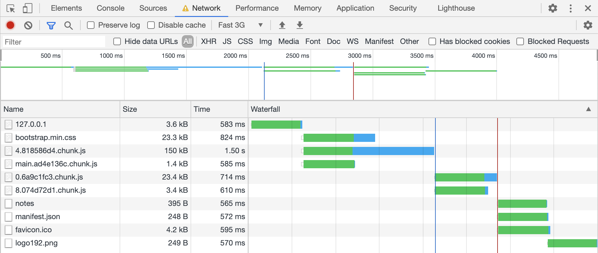

# S3 browser client in v2 vs v3

- This package contains frontend code which does put, get, delete operations using S3 browser client.
- This is a create-react-app which creates minimized bundle on running `build`, and debugs it on running `start`.

  <details><summary>Click to view screen recording</summary>
  <p>

  [](https://www.youtube.com/watch?v=qBltinDalzU)

  </p>
  </details>

## Table of Contents

- [Set up](#set-up)
  - [Steps to run frontend locally](#steps-to-run-frontend-locally)
  - [Clean resources](#clean-resources)
- [Activities](#activities)
  - [Examine initial bundle size of the app](#examine-initial-bundle-size-of-the-app)
  - [Reduce bundle size by just importing s3](#reduce-bundle-size-by-just-importing-s3)
  - [Reduce bundle size further by using client from v3](#reduce-bundle-size-further-by-using-client-from-v3)
  - [Reduce bundle size further by just importing specific commands in v3](#reduce-bundle-size-further-by-just-importing-specific-commands-in-v3)
  - [Separate chunks using code splitting with React.lazy](#separate-chunks-using-code-splitting-with-reactlazy)
- [Correlation between bundle size and load event](#correlation-between-bundle-size-and-load-event)
  - [Load event for bundle which imports entire v2](#load-event-for-bundle-which-imports-entire-v2)
  - [Load event for bundle which imports v3 client with commands with code splitting](#load-event-for-bundle-which-imports-v3-client-with-commands-with-code-splitting)
  - [Conclusion](#conclusion)

## Set up

Ensure that you've followed pre-requisites from main [README](../../README.md), and created [backend](../backend/README.md).

### Steps to run frontend locally

- `yarn prepare:frontend` to populate Cloudformation resources in frontend config.
- The resources can also be manually added in [`src/config.json`](./src/config.json).
  - Add `aws-js-sdk-workshop.GatewayUrl` from CDK output for `GATEWAY_URL`.
    - Example GatewayURL: `https://randomstring.execute-api.us-west-2.amazonaws.com/prod/`
  - Add `aws-js-sdk-workshop.IdentityPoolId` from CDK output for `IDENTITY_POOL_ID`.
    - Example IdentityPoolId: `us-west-2:random-strc-4ce1-84ee-9a429f9b557e`
  - Add `aws-js-sdk-workshop.FilesBucket` from CDK output for `FILES_BUCKET`.
- `yarn start:frontend` to run the server.
  - This will open the website in the browser, and enable HMR.
  - Just edit and save the files in `packages/frontend/src`, and the browser page will auto-refresh!
- `yarn build:frontend` to create optimized production build (to get file sizes).

### Clean resources

- Run `yarn cdk destroy` to delete Cloudformation Stack.

## Activities

In this section, we're going to update the code to import S3 browser Client in different ways and compare the bundle sizes of the resulting app.

### Examine initial bundle size of the app

- `yarn build:frontend` to generate bundle, which will create bundle of size ~395 KB.

  ```console
  File sizes after gzip:

    395.2 KB  build/static/js/2.9a081e7a.chunk.js
    2.88 KB   build/static/js/main.9af70d78.chunk.js
    792 B     build/static/js/runtime-main.64ddd279.js
  ```

- This happens because entire aws-sdk is bundled in the app in file [`s3Client.ts`](./src/libs/s3Client.ts).

  ```typescript
  import AWS from "aws-sdk";
  ```

### Reduce bundle size by just importing s3

- In v2, you can reduce the bundle size by doing dead-code elimination using [tree shaking with a bundler like webpack](https://webpack.js.org/guides/tree-shaking/).
- Just import the `"aws-sdk/clients/s3"` in [`s3Client.ts`](./src/libs/s3Client.ts), as shown in the diff below:

  ```diff
  -import AWS from "aws-sdk";
  +import AWS from "aws-sdk/global";
  +import s3 from "aws-sdk/clients/s3";
   import { IDENTITY_POOL_ID } from "../config.json";

  -const s3Client = new AWS.S3({
  +const s3Client = new s3({
    region: "us-west-2",
    credentials: new AWS.CognitoIdentityCredentials(
      {
  ```

- Run `yarn build:frontend` to generate bundle, and it's size will reduce to ~142 KB!

  ```console
  File sizes after gzip:

    141.77 KB  build/static/js/2.ec2b6b97.chunk.js
    2.88 KB    build/static/js/main.642e235c.chunk.js
    792 B      build/static/js/runtime-main.64ddd279.js
  ```

### Reduce bundle size further by using client from v3

- Uninstall v2 by running the following command:
  - `yarn remove aws-sdk`
- Install s3 dependencies by running the following command:
  - `yarn add @aws-sdk/client-s3 @aws-sdk/credential-provider-cognito-identity @aws-sdk/client-cognito-identity`
- Make the following change in [`s3Client.ts`](./src/libs/s3Client.ts):

  ```diff
  -import AWS from "aws-sdk";
  -import s3 from "aws-sdk/clients/s3";
  +import { S3 } from "@aws-sdk/client-s3";
  +import { fromCognitoIdentityPool } from "@aws-sdk/credential-provider-cognito-identity";
  +import { CognitoIdentityClient } from "@aws-sdk/client-cognito-identity";
  import { IDENTITY_POOL_ID } from "../config.json";

  -const s3Client = new AWS.S3({
  +const s3Client = new S3({
    region: "us-west-2",
  -  credentials: new AWS.CognitoIdentityCredentials(
  -    {
  -      IdentityPoolId: IDENTITY_POOL_ID,
  -    },
  -    {
  +  credentials: fromCognitoIdentityPool({
  +    client: new CognitoIdentityClient({
        region: "us-west-2",
  -    }
  -  ),
  +    }),
  +    identityPoolId: IDENTITY_POOL_ID,
  +  }),
  });
  ```

- The command calls on v3 client return promises by default, so you've to remove `.promise()`.
- For example, here's a diff for [`putObject.ts`](./src/libs/putObject.ts):

  ```diff
  const putObject = async (file: File) => {
    const Key = `${Date.now()}-${file.name}`;
    await s3Client
      .putObject({
        Key,
        Body: file,
        Bucket: config.s3Bucket,
  -    })
  -    .promise();
  +    });
    return Key;
  };
  ```

- To create and presign getObject URLs, you'll have to add more dependencies by running the following command:
  - `yarn add @aws-sdk/util-create-request @aws-sdk/s3-request-presigner @aws-sdk/util-format-url`
- Make the following change in [`getObjectURL.ts`](./src/libs/getObjectURL.ts):

  ```diff
  +import { createRequest } from "@aws-sdk/util-create-request";
  +import { GetObjectCommand } from "@aws-sdk/client-s3";
  +import { S3RequestPresigner } from "@aws-sdk/s3-request-presigner";
  +import { formatUrl } from "@aws-sdk/util-format-url";
  import { s3Client } from "./s3Client";
  import { FILES_BUCKET } from "../config.json";

  -const getObjectUrl = async (fileName: string) =>
  -  s3Client.getSignedUrlPromise("getObject", {
  -    Key: fileName,
  -    Bucket: FILES_BUCKET,
  +const getObjectUrl = async (fileName: string) => {
  +  const request = await createRequest(
  +    s3Client,
  +    new GetObjectCommand({
  +      Key: fileName,
  +      Bucket: FILES_BUCKET,
  +    })
  +  );
  +
  +  const signer = new S3RequestPresigner({
  +    ...s3Client.config,
    });

  +  const url = await signer.presign(request);
  +  return formatUrl(url);
  +};
  +
  export { getObjectUrl };
  ```

- Run `yarn build:frontend` to generate bundle, and it's size will reduce to ~124 KB!

  ```console
  File sizes after gzip:

    123.88 KB  build/static/js/2.d0ab40c6.chunk.js
    2.93 KB    build/static/js/main.81ee5280.chunk.js
    792 B      build/static/js/runtime-main.64ddd279.js
  ```

### Reduce bundle size further by just importing specific commands in v3

- AWS JS SDK v3 has an option to import specific commands, thus reducing bundle size further!
- Make the following change in [`s3Client.ts`](./src/libs/s3Client.ts) to import S3Client from v3:

  ```diff
  -import { S3 } from "@aws-sdk/client-s3";
  +import { S3Client } from "@aws-sdk/client-s3";
   import { fromCognitoIdentityPool } from "@aws-sdk/credential-provider-cognito-identity";
   import { CognitoIdentityClient } from "@aws-sdk/client-cognito-identity";
  ```

  ```diff
  -const s3Client = new S3({
  +const s3Client = new S3Client({
    region: "us-west-2",
    credentials: fromCognitoIdentityPool({
  ```

- Import and call just the `PutObjectCommand` in [`putObject.ts`](./src/libs/putObject.ts) for example:

  ```diff
  +import { PutObjectCommand } from "@aws-sdk/client-s3";
   import s3Client from "./s3Client";
   import { FILES_BUCKET } from "../config";

   const putObject = async (file: File) => {
    const Key = `${Date.now()}-${file.name}`;
  -  await s3Client
  -    .putObject({
  +  await s3Client.send(
  +    new PutObjectCommand({
        Key,
        Body: file,
        Bucket: FILES_BUCKET,
  -    });
  +    }));
    return Key;
   };
  ```

- Edit [`deleteObject.ts`](./src/libs/deleteObject.ts) using the changes your made to [`putObject.ts`](./src/libs/putObject.ts) as a template.

* Run `yarn build:frontend` to generate bundle, and it's size will reduce to ~102 KB!

  ```console
  File sizes after gzip:

    101.37 KB  build/static/js/2.01d127d9.chunk.js
    2.93 KB    build/static/js/main.1a8958f8.chunk.js
    792 B      build/static/js/runtime-main.64ddd279.js
  ```

### Separate chunks using code splitting with React.lazy

- We now import client and specific commands in v3, and can make use of code splitting with React.lazy().
- React.lazy currently [doesn't support named exports](https://reactjs.org/docs/code-splitting.html#named-exports). So, we need to default export components being lazily loaded.

  - For example, make the following change in [CreateNote.tsx](./src/content/CreateNote.tsx):

  ```diff
    );
  };

  -export { CreateNote };
  +export default CreateNote;
  ```

- Then lazily import components in [Routes.tsx](./src/Routes.tsx), and render them inside a Suspense component.

  ```diff
  -import React from "react";
  +import React, { lazy, Suspense } from "react";
   import { Router } from "@reach/router";
  -import { ListNotes, CreateNote, ShowNote, NotFound } from "./content";
  +
  +const ListNotes = lazy(() => import("./content/ListNotes"));
  +const CreateNote = lazy(() => import("./content/CreateNote"));
  +const ShowNote = lazy(() => import("./content/ShowNote"));
  +const NotFound = lazy(() => import("./content/NotFound"));

   const Routes = () => (
  -  <Router className="mt-md-4 d-flex flex-column justify-content-center">
  -    <ListNotes path="/" />
  -    <CreateNote path="/note/new" />
  -    <ShowNote path="/notes/:noteId" />
  -    <NotFound default />
  -  </Router>
  +  <div className="mt-md-4 d-flex flex-column justify-content-center">
  +    <Suspense fallback={<div>Loading...</div>}>
  +      <Router>
  +        <ListNotes path="/" />
  +        <CreateNote path="/note/new" />
  +        <ShowNote path="/notes/:noteId" />
  +        <NotFound default />
  +      </Router>
  +    </Suspense>
  +  </div>
   );

   export { Routes };
  ```

- Run `yarn build:frontend` to generate bundle, and it's going to be split into multiple chunks of even smaller sizes!

  ```console
  File sizes after gzip:

    47.81 KB  build/static/js/1.7e51cbd2.chunk.js
    46.96 KB  build/static/js/4.818586d4.chunk.js
    7.85 KB   build/static/js/0.6a9c1fc3.chunk.js
    3.02 KB   build/static/js/6.c7a500e3.chunk.js
    2.5 KB    build/static/js/5.12e58bc3.chunk.js
    1.72 KB   build/static/js/7.3d0fbc81.chunk.js
    1.33 KB   build/static/js/8.074d72d1.chunk.js
    1.24 KB   build/static/js/runtime-main.fb721bd4.js
    525 B     build/static/js/main.ad4e136c.chunk.js
  ```

## Correlation between bundle size and load event

Here is how we find out correlation between bundle size and load time:

- We create production bundle by running `yarn build`.
- We open the bundle in Chrome browser by running `yarn start`.
- In Chrome Developer Tools, we simulate "Fast 3G" under network tab.
- We hard reload the page.
- The comparison is between original bundle which imports entire v2 with final bundle which imports specific command with v3 and uses code splitting with React.lazy().

### Load event for bundle which imports entire v2

  <details><summary>Click to view image</summary>
  <p>


  </p>
  </details>

### Load event for bundle which imports v3 client with commands with code splitting

  <details><summary>Click to view image</summary>
  <p>



  </p>
  </details>

### Conclusion

As per our experiments:

- The large bundle with v2 takes ~17 seconds to fire load event.
- The small bundle with v3+command with code splitting fires load event within 3 seconds.
